# Data Generator

This is a group lab that will contribute towards your final project. One
person will submit this work.


Most application depends on data. In IoT
data is collected/generated by sensors. Since we do not have access to
sensors, we will have to generate data via code. Plotting a sufficient
number of these data points (500 in this case) should get the following
diagram or something very similar:

You will pick a quantity that you would like to simulate (such as
temperature, humidity, barometric pressure, customers arriving at a
mall, or just with an alternate descriptor) and decide what shape you
will emulate. This will guide you in selecting sensible values or
baselines for your data values (e.g., If you pick inside temperature
then the normal range will be 18-21^o^C).

Design and build a class that will model your sensor reasonably well.
Notice how the peaks do not occur at regular intervals, nor are they the
same height. Even the squiggles are the same shapes.

You will create a class with a single public member (property) that
provides a \"random\" value in your intended range and properties. You
should create a private method that actually generates a normalized
value \[a normalized value will be in the range 0 to 1\]. Then transform
this value by scaling and or transposing it to the range that you are
interested in.

Your class must have a fair amount of customization but at the same time
should be easy to use, so provide a constructor with lots of default
values. Make it so that you can generate your data by repeatedly
accessing a property of the class instance. There must not be a limit to
the number of values that you can get from your generator.

*All your subsequent labs MUST use this class when working with random
values.*

See sample code in the subsequent pages.


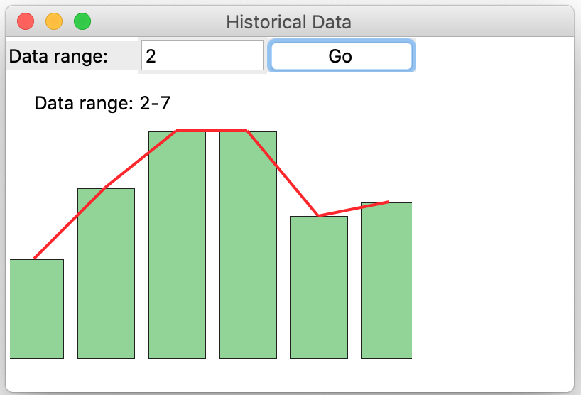

## Requirements

1. Create a **class** that does the following:

2. Create a **private method** that will generate random values in the
    range 0 - 1. Look at the examples at the end of this document for
    ideas on approaching this.

3. This method may take argument that can be passed by the property
    below.

4. Create a **public** **property** that will use the above member to
    return a value in your preferred range. You may use a simple
    transformation of the form:

5. You will use the Matplotlib library to display your data values. The
    output must look professional. You will label your **output axes**
    and **title** appropriately.

6. Code to drive (run your program)

See the appendix of this document for sample code and possible
directions to explore. You will need some combination of the last three
examples. DO NOT USE THE CODE AS IS! Look at the intention behind the
code.

#### Submission

1. You must use only the libraries that are available in the standard
    Python distribution.
2. Your code file will be named group_«your_group_number»_data_generator.py e.g. group_1_data_generator.py.

## Sample Code

The following examples illustrate the various possibilities for
generating data. You can also play with a [Jupyter
notebook](https://colab.research.google.com/drive/1QsxHRlUVITd-aQ0CMf_ubVw7qIdzXq_V?usp=sharing).

#### Constant Value

The first example gives you a constant value regardless of how many
times you call it.

```python
import matplotlib.pyplot as plt


def generator_1() -> int:
    """
    This is the greatest generator.
    It returns Narendra's favourite number
    """
    return 10


number_of_values = 200
y = [generator_1() for _ in range(number_of_values)]
x = [generator_1() for _ in range(number_of_values)]
plt.plot(x, y, "r+")
plt.show()
```

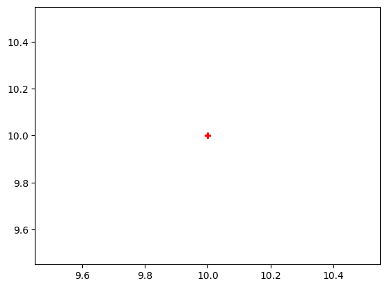

#### Uniform Values

The second example gives you a uniformly random value. It uses the
randint() method of the random class that returns a value in the
interval \[a, b\]. Uniform distributed values occur frequently in
everyday situations such as the odds of getting a particular value on
the toss of an un-biased die.

```python
import matplotlib.pyplot as plt
import random


def generator_2() -> int:
    """
    This generator gives you a uniform random number in a 0 to 20
    """
    return random.randint(0, 20)


number_of_values = 200
y = [generator_2() for _ in range(number_of_values)]
x = [generator_2() for _ in range(number_of_values)]
plt.plot(x, y, "r+")
plt.show()
```

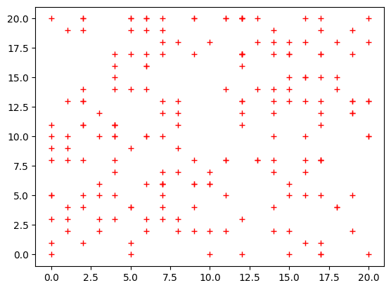

#### Standard Values

The third example gives you a normal random value. It uses the gauss()
method of the random class that returns a value based on a mean and a
standard deviation. Normal/standard distributed values also occur
frequently in everyday situations such as the number of students in a
queue waiting for the TTC bus are the Progress terminal. This is
different because the number of students in the line quickly builds up
to a maximum when the bus has arrived and a minimum when there is no
bus.

```python
import matplotlib.pyplot as plt
import random


def generator_3() -> int:
    return random.gauss(10, 1.0)


number_of_values = 200
y = [generator_3() for _ in range(number_of_values)]
x = [generator_3() for _ in range(number_of_values)]
plt.plot(x, y, "r.")
plt.show()
```

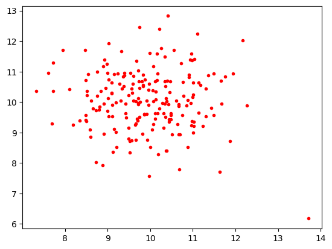

If you increase the number of points, you will see there is a cluster at
the centre of the grid.

#### Pattern Values

The fourth example gives you a value that follows a predictable pattern.
It uses the Gauss method of the random class that returns a value based
on a mean and a standard deviation. Normal/standard distributed values
also occur frequently in everyday situations such as the number of
students in a queue waiting for the TTC bus are the Progress terminal.
This is different because the number of students in the line quickly
builds up to a maximum when the bus has arrived and a minimum when there
is no bus.

```python
value = {"base": 10, "delta": 0.15}


def generator_4(increment=True) -> float:
    if increment:
        value["base"] += value["delta"]
    else:
        value["base"] -= value["delta"]
    return value["base"]


number_of_values = 200
y = [generator_4((x % 50) > 24) for x in range(number_of_values)]
plt.plot(y, "g")
plt.show()

```

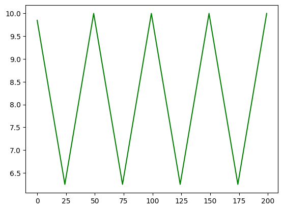

## Appendix

### NumPy

The numpy is extremely capable library that is extensively used in a wide range of applications but not so much in networking. **So you will not be tested on this library**.
The following is a demonstration of this very optimized library.

### *Using numpy for networking*

numpy is a package suitable for numerical computation. It must be install externally e.g. pip install numpy.  
In mathematics a numpy array is like a vector

```
import numpy as np
```

### Returns a numpy array with items evenly spaced within a given half-closed interval

np.arange([start=0], end, [steps=1])

```
a = np.arange(3, 10, 2)
a
```

    array([3, 5, 7, 9])

Using the defaults of first as 0 and steps to be 1.

```
a = np.arange(4)
a
```

    array([0, 1, 2, 3])

### Returns a numpy array with the specified number of items

.linspace(start, stop, [number_of_values=50]

```
b = np.linspace(3, 4, 5)
b
```

    array([3.  , 3.25, 3.5 , 3.75, 4.  ])

utilizing the default value of the last argument

```
b = np.linspace(2, 198, dtype=int)
b
```

    array([  2,   6,  10,  14,  18,  22,  26,  30,  34,  38,  42,  46,  50,
            54,  58,  62,  66,  70,  74,  78,  82,  86,  90,  94,  98, 102,
           106, 110, 114, 118, 122, 126, 130, 134, 138, 142, 146, 150, 154,
           158, 162, 166, 170, 174, 178, 182, 186, 190, 194, 198])

### Creating a numpy array using values from a list

A simple list

```
c = np.array([2, 3, 5, 7, 11])
c
```

    array([ 2,  3,  5,  7, 11])

Values from a nested list

```
c = np.array([[1, 2], [3, 4], [5, 6]]) 
c
```

    array([[1, 2],
           [3, 4],
           [5, 6]])

### Creating a numpy array from an exising one

```
e = np.reshape(np.arange(24), (4,2,3))
e
```

    array([[[ 0,  1,  2],
            [ 3,  4,  5]],
    
           [[ 6,  7,  8],
            [ 9, 10, 11]],
    
           [[12, 13, 14],
            [15, 16, 17]],
    
           [[18, 19, 20],
            [21, 22, 23]]])

By transposing.

```
e = np.array([[1, 2], [3, 4], [5, 6]]).T
e
```

    array([[1, 3, 5],
           [2, 4, 6]])

generating random values with uniform distribution

```
f = np.random.rand(2, 5)
f
```

    array([[0.339673  , 0.1002474 , 0.84477942, 0.75846875, 0.40865231],
           [0.15343869, 0.33195172, 0.36590536, 0.00273014, 0.44985903]])

Generating random values with standard normal (gauss) distribution (mean = 0 and variance = 1)

```
f = np.random.randn(3, 2)
f
```

    array([[-1.24130646,  2.92357033],
           [ 0.32228798,  0.18604171],
           [-1.65881246,  1.27148109]])

### Operations on numpy arrays

Operations that returns a scalar
Most of the commands are self-explanatory

```
h = np.random.randn(100)
h.min()


```

    -2.1802766477994395

```
h.max()
```

    2.286174786369379

```
h.mean()
```

    -0.07222027578827235

```
h.var()
```

    0.762875580452302

Operations between numpy array and scalar that returns a numpy array.

Again the operations are self-explanatory

```
h + 2

```

    array([ 2.53007607,  1.57342416,  3.4481477 ,  0.88452168,  2.12428762,
            1.50145121,  2.40252638,  1.79311677,  1.81313202,  2.06966808,
            2.88437657,  1.54732754,  2.88298888,  3.78339164,  2.28249491,
            2.16046333,  1.87502806,  0.786227  ,  1.80736585,  0.14643594,
            2.08096838,  1.80806036,  3.99762773,  1.17696657,  1.94548494,
            2.94316675,  2.87492623,  1.86949851,  1.17088915,  2.19764071,
            0.49302774,  2.56883567,  1.88119263,  1.883648  ,  2.07128687,
            0.36871354,  1.25830156,  1.47367293,  1.93312634,  1.33260998,
            3.10489617,  0.73182444,  2.51239503,  1.32252736,  1.43112931,
            2.50329415,  2.65174721,  3.03814784,  0.78402036,  0.41739637,
            3.71048572,  3.01678315,  1.25697624,  1.52160011,  1.08310461,
            2.04602933,  2.64409137, -0.07378297,  2.30501884,  2.69681614,
            1.32630626,  2.21370446,  1.86392376,  1.47402765,  1.73807866,
            2.4758921 ,  2.62166716,  1.1769691 ,  3.08561382,  2.46576155,
            2.52397453,  3.4867555 ,  1.60251604,  2.26614842,  2.91396729,
            1.64391671,  1.95003254,  0.91687296,  2.39697762,  0.58597679,
            2.3449359 ,  4.08689501,  0.21643291,  2.01822055,  2.12873284,
            1.50031867,  3.50955617,  2.25433907,  1.48649143,  3.11884541,
            2.59735903,  1.12590136,  2.11974628,  1.06146348,  2.5312954 ,
            2.81922742,  2.25943061,  2.3804573 ,  2.74091552,  0.14156038])

```
h * 10

```

    array([  9.5224773 ,  11.0012462 ,   6.57030582,  -0.41566104,
            14.3690303 ,   1.04624622,   4.41589924,  -9.53119989,
            -6.72248916, -15.59677972,  -8.85891239, -11.65959652,
           -14.14904259,  -0.90754847,   6.03942147,  -6.05348588,
           -18.84207344, -13.81987222,  -1.62403057,   7.14461579,
             0.87370183,   0.94578223,  -2.73270179,   0.98816899,
            -6.45009074,  -4.2234528 ,  11.89724215, -11.29967956,
             6.46043683,   6.29253059,  -2.22043786,   6.54406738,
             0.08440457,  -0.83411399,  -1.89222719,  11.432351  ,
             1.47718277,   9.64616154,  14.14084657,  -2.30177708,
           -10.80830817,   6.69810292,   0.1554458 ,   9.59855124,
            -0.82353673,  -7.30680483,  10.7211509 , -13.44092908,
            13.60881417,  -8.92108843,  -3.85260028,   9.36182819,
            22.86174786,   1.99654085,  -8.43400127,   2.48268   ,
           -20.74420686,   3.74726556,   1.34856355, -12.60410787,
             1.099078  ,   2.47433005,  -9.88105028, -12.7546724 ,
            17.69035167,  -4.87859397, -11.61929412,   5.18881835,
             5.6843768 ,   3.50740786,  12.87014195, -11.26883221,
            -0.23722813,   3.81351664,  -5.99749333, -21.80276648,
            -7.66464108, -13.12558931,   4.92538567,  -4.06935041,
            -7.43108556,   9.92187427,  -2.29126162,  -8.85998485,
            -2.20476588,  -0.85713951,   6.2505395 ,   3.75384228,
            -8.50444306,  -8.8554038 ,   4.86847196,   2.17331944,
             2.16845961,   4.30329697,  -8.62513283,   7.64273123,
            -4.53612248,  -8.41802421,   3.56246354,   3.36214049])

### Working with multi-dimensional array

```
#zero dimension (just a scalar)
k = np.array(1.1)
print(k.shape)
print(k)
```

    ()
    1.1

```
#one dimensional
k = np.array([1.1])
print(k.shape)
print(k)

k = np.array([1.1, 1.2, 1.3, 1.4])
print(k.shape)
print(k)
```

    (1,)
    [1.1]
    (4,)
    [1.1 1.2 1.3 1.4]

```
#two dimensional 1x1
k = np.array([[1.1]])
print('\n', 'shape: ', k.shape)
print(k)

#two dimensional 1x4
k = np.array([[1.1, 1.2, 1.3, 1.4]])
print('\n', 'shape: ', k.shape)
print(k)

#two dimensional 4x1
k = np.array([[1.1], 
              [2.1], 
              [3.1], 
              [4.1]])
print('\n', 'shape: ', k.shape)
print(k)

#two dimensional 2x4
k = np.array([[1.1, 1.2, 1.3, 1.4],
              [2.1, 2.2, 2.3, 2.4]])
print('\n', 'shape: ', k.shape)
print(k)
```

     shape:  (1, 1)
    [[1.1]]
    
     shape:  (1, 4)
    [[1.1 1.2 1.3 1.4]]
    
     shape:  (4, 1)
    [[1.1]
     [2.1]
     [3.1]
     [4.1]]
    
     shape:  (2, 4)
    [[1.1 1.2 1.3 1.4]
     [2.1 2.2 2.3 2.4]]

#### 3 Dimensions

```
# 1x1x1
k = np.array([[[1.101]]])
print('\n', 'shape: ', k.shape)
print(k)

```

     shape:  (1, 1, 1)
    [[[1.101]]]

```
# 1x1x4
k = np.array([[[1.101, 1.102, 1.103, 1.104]]])
print('\n', 'shape: ', k.shape)
print(k)

```

     shape:  (1, 1, 4)
    [[[1.101 1.102 1.103 1.104]]]

```
# 4x1x1
k = np.array([[[1.101],
               [2.101],
               [3.101],
               [4.101]]])
print('\n', 'shape: ', k.shape)
print(k)

# 4x1x1
k = np.array([[[1.101]],
              [[2.101]],
              [[3.101]],
              [[4.101]]])
print('\n', 'shape: ', k.shape)
print(k)

#three dimensions 1x4x1
k = np.array([[[1.101,1.201, 1.301, 1.401]]])
print('\n', 'shape: ', k.shape)
print(k)
```

     shape:  (1, 4, 1)
    [[[1.101]
      [2.101]
      [3.101]
      [4.101]]]
    
     shape:  (4, 1, 1)
    [[[1.101]]
    
     [[2.101]]
    
     [[3.101]]
    
     [[4.101]]]
    
     shape:  (1, 1, 4)
    [[[1.101 1.201 1.301 1.401]]]

```
#three dimensions 1x4x3
k = np.array([[[1.101, 1.102, 1.103],
               [1.201, 1.202, 1.203], 
               [1.301, 1.302, 1.303], 
               [1.401, 1.402, 1.403]]])
print('\n', 'shape: ', k.shape)
print(k)

#three dimensions 2x4x3
k = np.array([[[1.101, 1.102, 1.103],
               [1.201, 1.202, 1.203], 
               [1.301, 1.302, 1.303], 
               [1.401, 1.402, 1.403]],
              [[2.101, 2.102, 2.103],
               [2.201, 2.202, 2.203], 
               [2.301, 2.302, 2.303], 
               [2.401, 2.402, 2.403]]])
print('\n', 'shape: ', k.shape)
print(k)
```

     shape:  (1, 4, 3)
    [[[1.101 1.102 1.103]
      [1.201 1.202 1.203]
      [1.301 1.302 1.303]
      [1.401 1.402 1.403]]]
    
     shape:  (2, 4, 3)
    [[[1.101 1.102 1.103]
      [1.201 1.202 1.203]
      [1.301 1.302 1.303]
      [1.401 1.402 1.403]]
    
     [[2.101 2.102 2.103]
      [2.201 2.202 2.203]
      [2.301 2.302 2.303]
      [2.401 2.402 2.403]]]

#### ndarrays and image data

The shape of an image data depends on the type of color mode of the image

- grayscale ->  (h, w). Each pixel (item of the array) will represent a single grayscale value
- rgb -> (h, w, 3). Each pixel will represent a array of (r, g, b) value
- for other color space the three values represent other things

```
import matplotlib.pyplot as plt
ones = np.ones([2, 4, 3], 'uint8') #the pixel values is 1 which is almost black
# print(ones.shape)
# print(ones)
white = ones * (2 ** 8 - 1)        #the pixel values is 255 which is white
print(white)
line = white.copy();
# print(line)
for x in range(4):
  line[1][x][1]= 0
print(line)

plt.suptitle('image is 2 pixel tall and 4 pixels wide')
plt.subplot(131), plt.imshow(ones), plt.title('black') 
plt.subplot(132), plt.imshow(white), plt.title('white')  
plt.subplot(133), plt.imshow(line), plt.title('line')    
plt.show()
```

    [[[255 255 255]
      [255 255 255]
      [255 255 255]
      [255 255 255]]
    
     [[255 255 255]
      [255 255 255]
      [255 255 255]
      [255 255 255]]]
    [[[255 255 255]
      [255 255 255]
      [255 255 255]
      [255 255 255]]
    
     [[255   0 255]
      [255   0 255]
      [255   0 255]
      [255   0 255]]]


```
#black 2x4 image
black = np.array([[[0, 0, 0], [0, 0, 0], [0, 0, 0], [0, 0, 0]],
                  [[0, 0, 0], [0, 0, 0], [0, 0, 0], [0, 0, 0]]])

plt.imshow(black)
plt.show()
```


```
#checkered 2x4 image
check = np.array([[[0, 0, 0],       [255, 0, 0],   [0, 255, 0],   [0, 0, 255]],
                  [[255, 255, 255], [255, 255, 0], [0, 255, 255], [255, 0, 255]]])

plt.imshow(check)
plt.show()
```


```
#checkered 4x7 image
check = np.array([
                  [[255, 255, 255], [255, 225, 127], [255, 255, 0],   [255, 127, 255], [255, 127, 0],   [255, 0, 255],   [127, 0, 255]],
                  [[255, 0, 0],   [255, 255, 255], [255, 225, 127], [255, 255, 0],   [255, 127, 255], [255, 127, 127], [255, 0, 255]],
                  [[0, 255, 0],   [255, 0, 0],   [255, 255, 255], [255, 225, 127], [255, 255, 0],   [255, 127, 255], [255, 127, 127]],
                  [[0, 0, 255],     [0, 255, 0],   [255, 0, 0],   [255, 255, 255], [255, 225, 127], [255, 255, 0],   [255, 127, 255]]])

#9x9 image
check1 = np.array([
                  [[255, 255, 255], [255, 255, 127], [255, 255, 0],   [255, 127, 255], [255, 127, 127], [255, 127, 0],   [255, 0, 255],   [255, 0, 127],   [255, 0, 0]],
                  [[127, 255, 255], [127, 255, 127], [127, 255, 0],   [127, 127, 255], [127, 127, 127], [127, 127, 0],   [127, 0, 255],   [127, 0, 127],   [127, 0, 0]],
                  [[0, 255, 255],   [0, 255, 127],   [0, 255, 0],     [0, 127, 255],   [0, 127, 127],   [0, 127, 0],     [0, 0, 255],     [0, 0, 127],     [0, 0, 0]],
                  [[0, 255, 127],   [0, 255, 0],     [0, 127, 255],   [0, 127, 127],   [0, 127, 0],     [0, 0, 255],     [0, 0, 127],     [0, 0, 0],       [0, 255, 255]],
                  [[0, 255, 0],     [0, 127, 255],   [0, 127, 127],   [0, 127, 0],     [0, 0, 255],     [0, 0, 127],     [0, 0, 0],       [0, 255, 255],   [0, 255, 127]],
                  [[0, 127, 255],   [0, 127, 127],   [0, 127, 0],     [0, 0, 255],     [0, 0, 127],     [0, 0, 0],       [0, 255, 255],   [0, 255, 127],   [127, 255, 255]],
                  [[0, 127, 127],   [0, 127, 0],     [0, 0, 255],     [0, 0, 127],     [0, 0, 0],       [0, 255, 255],   [0, 255, 127],   [127, 255, 255], [255, 255, 255]],
                  [[0, 127, 0],     [0, 0, 255],     [0, 0, 127],     [0, 0, 0],       [0, 255, 255],   [0, 255, 127],   [127, 255, 255], [255, 255, 255], [255, 255, 127]],
                  [[0, 0, 255],     [0, 0, 127],     [0, 0, 0],       [0, 255, 255],   [0, 255, 127],   [127, 255, 255], [255, 255, 255], [255, 255, 127], [255, 255, 0]]])
plt.imshow(check)
plt.show()

```


```
foo = check.copy()
# foo[:,:,0] = 0          #sets the red component to 0
# foo[:,:,1] = 0          #sets the green component to 0
# foo[:,:,2] = 0          #sets the blue component to 0
foo[:,:,(0, 1)] = 0     #sets both the red and green component to 0
plt.imshow(foo)
plt.show()
```


```
h, w, _ = check.shape
tmp = np.zeros((h, w), 'uint8')

for i in range(h):
  for j in range(w):
    clr = check[i, j]
    val = 0
    for c in clr:
      val += c
    val //= len(clr)
    tmp[i, j] = val  

plt.imshow(tmp, cmap='gray')
plt.show()

```


```
h, w, _ = check.shape
print(h, w)
clr = foo[0,0]
len(clr)

print(check, '\n')
print(tmp.shape, '\n', tmp)
```

    4 7
    [[[255 255 255]
      [255 225 127]
      [255 255   0]
      [255 127 255]
      [255 127   0]
      [255   0 255]
      [127   0 255]]
    
     [[255   0   0]
      [255 255 255]
      [255 225 127]
      [255 255   0]
      [255 127 255]
      [255 127 127]
      [255   0 255]]
    
     [[  0 255   0]
      [255   0   0]
      [255 255 255]
      [255 225 127]
      [255 255   0]
      [255 127 255]
      [255 127 127]]
    
     [[  0   0 255]
      [  0 255   0]
      [255   0   0]
      [255 255 255]
      [255 225 127]
      [255 255   0]
      [255 127 255]]] 
    
    (4, 7) 
     [[255 202 170 212 127 170 127]
     [ 85 255 202 170 212 169 170]
     [ 85  85 255 202 170 212 169]
     [ 85  85  85 255 202 170 212]]

### Matplotlib

The matplotlib library is a feature-rich library that is also extensively used in a wide range of applications.

The notebook covers most of the capabilites of this library.  **You will not be tested on the more exotic features of this library.** Just the basic bar charts and line graphs.

#### Using matplotlib for COMP216

Matplotlib is a graphical library for generating high quality scientific figures.

- You have control over the size and resolution  
-  

We will use numpy to generate data for our graphs

The third line is necessary for the matplotlib image to show up in the jupyter notebook

[see for more info](https://nbviewer.jupyter.org/github/jrjohansson/scientific-python-lectures/blob/master/Lecture-4-Matplotlib.ipynb)

```

```

```
import numpy as np
import matplotlib.pyplot as plt
%matplotlib inline 
y = [1, 2, 3, 4] #the data points
plt.plot(y)      #the second set of points is generated by matplotlib
plt.show()       #shows the output onscreen
```


Here the x values are strings, so matplotlib assigns an index when plotting

```
temp = [22.2, 22.1, 22.5, 21.9, 22.1, 22.6, 22.3]
days = 'Sun Mon Tue Wed Thu Fri Sat'.split()
plt.plot(days, temp)
plt.show()
```


Plot with red dot markers

```
x = [0, 1, 2, 3, 4]
y = [0, 1, 4, 9, 16]
plt.axis([0, 4.2, 0, 17]) #sets the limit on the horizontal and vertical axis
plt.plot(x, y, 'ro')      #use red dots as markers
plt.show()
```


Drawing a line y = 0.4x, a parabola y =sqrt(x) and a sin curve y = sin(x)

```
t = np.arange(0, 5, .2)
print(t)
plt.plot(t, t*.4, 'r--', t, t**.5, 'b+', t, np.sin(t), 'g^')
plt.title('Some simple curves')
plt.show()
```

    [0.  0.2 0.4 0.6 0.8 1.  1.2 1.4 1.6 1.8 2.  2.2 2.4 2.6 2.8 3.  3.2 3.4
     3.6 3.8 4.  4.2 4.4 4.6 4.8]


Moving the axes to where is more familar position

```
t = np.arange(0, 8, .2)
plt.plot(t, t*.1, 'r--', t, np.abs(np.sin(t)), 'b', t, np.sin(t), 'g')
plt.axhline()
plt.axvline()
plt.box(False)
plt.title('Some simple curves')
plt.show()
```


A more complex example

```
x = np.linspace(-0.001, 20, 500)
y = np.sin(x) / x

fig, ax = plt.subplots(figsize=(8, 4))

ax.plot(x, y, linewidth=2)

# remove top and right spines
ax.spines['right'].set_color('none')
ax.spines['top'].set_color('none')

# remove top and right spine ticks
ax.xaxis.set_ticks_position('bottom')
ax.yaxis.set_ticks_position('left')

# move bottom and left spine to x = 0 and y = 0
ax.spines['bottom'].set_position(('data', 0))
ax.spines['left'].set_position(('data', 0))

ax.set_xticks([5, 10, 15, 20])
ax.set_yticks([0.25, 0.50, 0.75, 1.0])

# give each label a solid background of white, to not overlap with the plot line
for label in ax.get_xticklabels() + ax.get_yticklabels():
    label.set_bbox({'facecolor': 'white', 'edgecolor': 'white'})

plt.show()
```


Plotting a bar chart

```
height = [3, 12, 5, 18, 11]
bars = ('A', 'B', 'C', 'D', 'E')
plt.bar(bars, height)
plt.show()
```


Plotting a horizontal bar chart.
A label is set for the x-axis

```
weight = [3, 2, 10, 8, 5]
items = 'Apple Banana Cherry Dorian Grape'. split()
plt.barh(items, weight, color='#ff9966')
plt.xlabel('Quantity /kg')
plt.show()
```


In this plot the colors of each bar is also specified.

```
years = [3, 2, 10, 8, 5]
profs = 'Mayy Ilia Hao Yin Tom'.split()
clrs = 'pink red green blue cyan'.split()
plt.bar(profs, years, color=clrs, edgecolor='k')
plt.xlabel('Professor')         #horizontal axis
plt.ylabel('Service')           #vertical axis
plt.title('Centennial College') #top of the figure
```

    Text(0.5, 1.0, 'Centennial College')


Values of each bar is written at the top.
The x labels are rotated.

```
years = [6, 2, 4, 8, 5]
profs = ['Nicoletta Zouri', 'Patrick Gignac', 'Narendra Pershad', 'Mohammed Khan', 'Joanne Filotti']
clrs = 'pink red green blue cyan'.split()
plt.bar(profs, years, color=clrs, edgecolor='k')
plt.xlabel('Professor')
plt.xticks(rotation=45)
plt.ylabel('Service')

#put some text at the top of each bars
for i in range(len(profs)):
  plt.text(x=i-0.40, y=years[i]+.1, s=f'{profs[i].split()[0]}={years[i]}')

plt.title('Centennial College')

plt.tick_params(axis='x', colors='red', direction='out', length=13, width=3)
plt.show()
```


A stacked bar chart. There seems to be a duplication of the loop body. This is to prevent each iteration of the loop from adding a label to the legend.

Each bar goes on top of the previous bar, so the bottom of a bar must be the top of the previous bar.

```
gp = [53, 50, 34]
ai = [45, 40, 30]
set = [72, 85, 50]
sety = [68, 70, 45]
hit = [25, 20, 20]

#set the label
plt.bar(0, gp[0], color='#adb0ff', label='Game Programming')
plt.bar(0, ai[0], color='#ffb3ff', bottom=gp[0], label='Artificial Inteligence')
plt.bar(0, set[0], color='#90d595', bottom=gp[0]+ai[0], label='Software Engineering Technician')
plt.bar(0, sety[0], color='#e48381', bottom=gp[0]+ai[0]+set[0], label='Software Engineering Technology')
plt.bar(0, sety[0], color='#aafbff', bottom=gp[0]+ai[0]+set[0]+sety[0], label='Health Information Technology')

#does not set labels
for x in range(1, 3):
  plt.bar(x, gp[x], color='#adb0ff')
  plt.bar(x, ai[x], color='#ffb3ff', bottom=gp[x])
  plt.bar(x, set[x], color='#90d595', bottom=gp[x]+ai[x])
  plt.bar(x, sety[x], color='#e48381', bottom=gp[x]+ai[x]+set[x])
  plt.bar(x, hit[x], color='#aafbff', bottom=gp[x]+ai[x]+set[x]+sety[x])


plt.legend(loc='center left', bbox_to_anchor=(1.1, 0.5), labelspacing=3)
plt.show()
```


1. Two titles, one anchor on the left and the other anchor on the right
2. Using TeX

Use with care, some symbols does not work. The following works:

\zeta \delta \epsilon \eta \omega \gamma \kappa  \sigma \phi \lambda  \chi

```
import matplotlib
t = np.linspace(-2*np.pi, 2 *np.pi, 100)
plt.plot(t, np.sin(t)* np.sin(t), marker=matplotlib.markers.CARETDOWNBASE)
plt.title('$y = \mu sin^2(2 \omega \gamma) \sharp  $', fontsize=16, color='salmon' , loc='left')
plt.title(f'The equation is not correct', fontsize=12, style='italic', color='grey' , loc='right')
#plt.box(False)
plt.show()
```


A scatter plot is shown below.

```
x = np.random.randn(500)
y = np.random.randn(500)
plt.scatter(x, y)
plt.show()
```


Pie Chart

```
weight = [3, 2, 10, 8, 5]
items = 'Apple Banana Cherry Dorian Grape'. split()
plt.pie(weight, labels=items)
plt.show()
```


Sub plots

This is used to display multiple plots on the same diagram

```
plt.suptitle('Four figures in one', color='blue', fontsize=20)

# the first plot
plt.subplot(221)
plt.title('Line Chart', loc='left')
temp = [22.2, 22.3, 22.5, 21.8, 22.5, 23.4, 22.8]
days = 'Sun Mon Tue Wed Thu Fri Sat'.split()
plt.plot(days, temp)

#the second plot
plt.subplot(222)
plt.title('Bar Chart', loc='right')
weight = [3, 2, 10, 8, 5]
items = 'A B C D E'. split()
plt.bar(items, weight, color='#6699ff')

#the third plot
plt.subplot(223)
plt.title('Pie Chart')
weight = [3, 2, 10, 8, 5]
items = 'Apple Banana Cherry Dorian Grape'. split()
plt.pie(weight, labels=items)

#the fourth plot
plt.subplot(224)
plt.title('Horizontal Bar Chart')
weight = [3, 2, 10, 8, 5]
items = 'Apple Banana Cherry Dorian Grape'. split()
plt.barh(items, weight, color='#ff9966')
plt.xlabel('Quantity /kg')


plt.tight_layout()
#now show the plot
plt.show()
```


```
# Fixing random state for reproducibility
np.random.seed(19680801)

# Compute areas and colors
N = 150
r = 2 * np.random.rand(N)
theta = 2 * np.pi * np.random.rand(N)
area = 200 * r**2
colors = theta

fig = plt.figure()
ax = fig.add_subplot(111, projection='polar')
c = ax.scatter(theta, r, c=colors, s=area, cmap='hsv', alpha=0.75)
plt.show()
```


```
fig = plt.figure()
ax = fig.add_subplot(111, polar=True)
c = ax.scatter(theta, r, c=colors, s=area, cmap='hsv', alpha=0.75)

ax.set_rorigin(-2.5)
ax.set_theta_zero_location('W', offset=10)
plt.show()
```


```
fig = plt.figure()
ax = fig.add_subplot(111, polar=True)
c = ax.scatter(theta, r, c=colors, s=area, cmap='hsv', alpha=0.75)

ax.set_thetamin(45)
ax.set_thetamax(135)

plt.show()
```


```
#polor curve
# creating an array 
# containing the radian values 
rads = np.arange(0, 20 * np.pi, 0.1)  
rads = np.arange(1.5*np.pi, 4 * np.pi, 0.1)  
  
# plotting the spiral 
for rad in rads: 
    r = rad 
    plt.polar(rad, r, 'b+') 
      
# display the polar plot 
plt.show()
print(f'number of points {len(rads)}')
```


    number of points 79

### Data Generation

1. No variation
2. Uniform distriibution
3. Normal distribution
4. More complex examples

```
import random
import matplotlib.pyplot as plt
%matplotlib inline
```

No variation.  
This function returns the same value.

```
def generator_1() -> float:
  return 0.5

number_of_data_values = 200
y_data = [generator_1() for _ in range(number_of_data_values)] #generates y data values
x_data = [generator_1() for _ in range(number_of_data_values)] #generates x data values

plt.plot(x_data, y_data, 'r+')      #use red + as markers
plt.show()
```

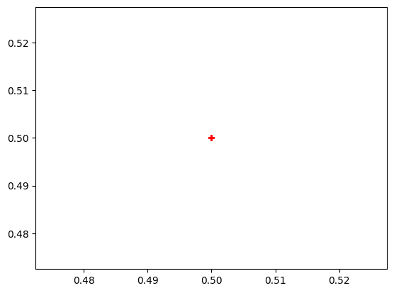

Uniform distribution.
The random.randint returns an int the interval [a, b]. This value is uniformly distributed in the interval. The plot show you what a uniform distribution looks like.
Examples of this kinds of distibution includes getting a particular number when an unbiased die is tossed.  
Most natural events are NOT uniformly distributed.

```
def generator_2() -> int:
  return random.random()

y_data = [generator_2() for _ in range(number_of_data_values)]
x_data = [generator_2() for _ in range(number_of_data_values)]

plt.plot(x_data, y_data, 'b+')      #use blue plus as markers
plt.show()
```

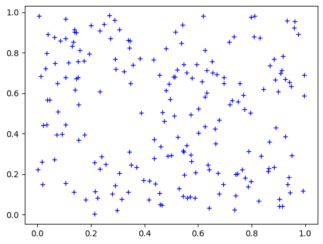

```
#a better way to show the distribution
size = 100_000
y_data = [int(generator_2() * 50) for _ in range(size)]
print(max(y_data))
d = {x: 0 for x in range(max(y_data) + 1)}
for x in y_data:
    d[x] += 1

plt.bar(d.keys(), d.values())
plt.show()
```

    49

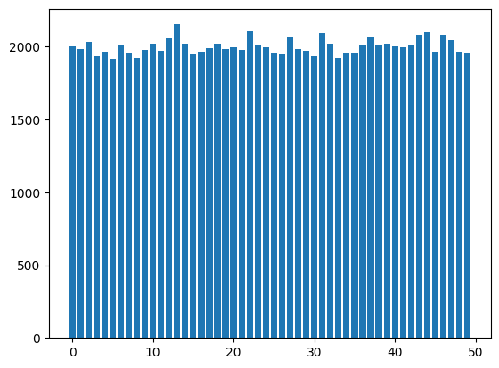

Normal/Standard/Gaussian distribution.
The description of this distribution needs two values a mean and a standard deviation.

```
def generator_3() -> float:
  return random.gauss(0.5, 0.1) # mean and spread

y_data = [generator_3() for _ in range(number_of_data_values)]
x_data = [generator_3() for _ in range(number_of_data_values)]

plt.plot(range(0, 1))
plt.plot(x_data, y_data, 'k.')      #use black dots as markers
plt.show()
```

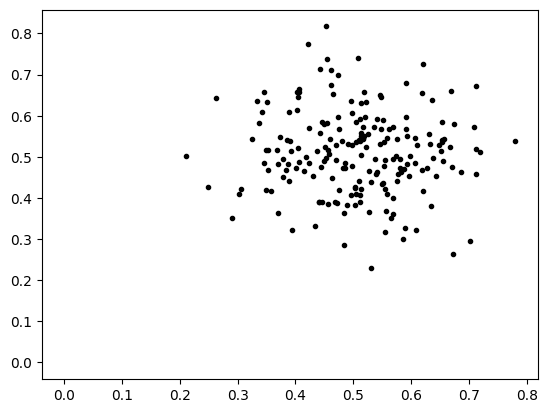

```
#a better way to show normal/standard/gaussian distribution
size = 10_000
y_data = [int(generator_3() * 50) for _ in range(size)]
d = {x: 0 for x in range(min(y_data), max(y_data) + 1)}
for x in y_data:
    d[x] += 1

plt.bar(d.keys(), d.values())
plt.show()
```

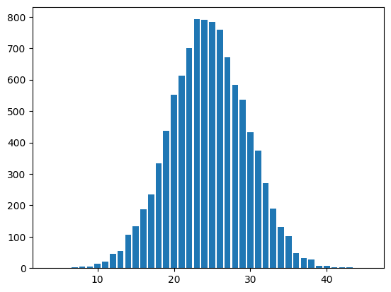

The above diagram shows you that the values are not uniformly random, there are more value clustered around the mean and less values away from the mean.

The "shape" of the bars is determined by the two arguments for the *random.gauss* function

```
from numpy.core.function_base import linspace
import math
period = 2 * math.pi
number_of_cycles = 5
width = period * number_of_cycles
ordinates = linspace(0, width, 500)

def func1(x):
  return 0

def func2(x):
  return math.sin(x)

def func3(x):
  s = math.sin(x)
  if s > 0:
    s = 1
  elif s < 0:
    s = -1
  else:
    s = 0
  return s

def func4(x):
  return math.pow(math.e, -x* 0.1)

def generate_points_no_noise(func, ordinates):
  return [func(x) for x in ordinates]

def generate_points_uniform_noise(func, ordinated, level):
  return [func(x) + random.randint(-level, level) * 0.01 for x in ordinates]

def generate_points_gaussian_noise(func, ordinated, level):
  return [func(x) + random.gauss(0, level) for x in ordinates]
```

```
fig, axs = plt.subplots(3)
fig.suptitle('none, uniform and gaussian noise')
axs[0].plot(generate_points_no_noise(func1, ordinates))
axs[1].plot(generate_points_uniform_noise(func1, ordinates, 20))
axs[2].plot(generate_points_gaussian_noise(func1, ordinates, .01))
plt.show()
```

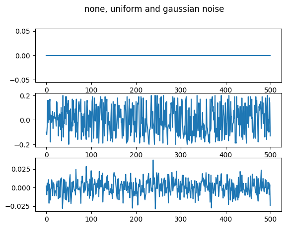

```
fig, axs = plt.subplots(3)
fig.suptitle('none, uniform and gaussian noise')
axs[0].plot(generate_points_no_noise(func2, ordinates))
axs[1].plot(generate_points_uniform_noise(func2, ordinates, 10))
axs[2].plot(generate_points_gaussian_noise(func2, ordinates, .1))
plt.show()
```

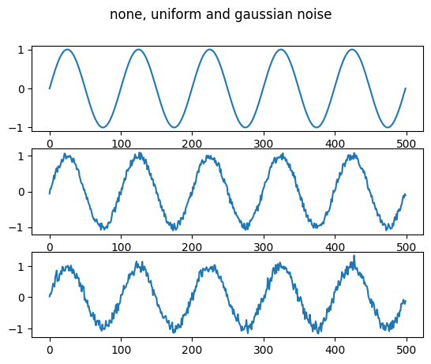

```
fig, axs = plt.subplots(3)
fig.suptitle('none, uniform and gaussian noise')
axs[0].plot(generate_points_no_noise(func3, ordinates))
axs[1].plot(generate_points_uniform_noise(func3, ordinates, 10))
axs[2].plot(generate_points_gaussian_noise(func3, ordinates, .1))
plt.show()
```


```
fig, axs = plt.subplots(3)
fig.suptitle('none, uniform and gaussian noise')
axs[0].plot(generate_points_no_noise(func4, ordinates))
axs[1].plot(generate_points_uniform_noise(func4, ordinates, 10))
axs[2].plot(generate_points_gaussian_noise(func4, ordinates, .1))
plt.show()
```

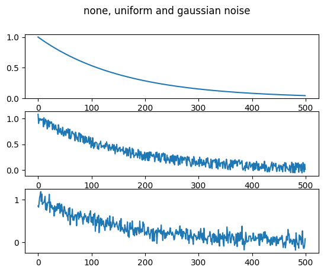

```
size = 500
value = {
    'base':0.5,        #the base value, you add or subtract a bit from this
    'delta': 0.005,    #this the change to add or subtract  from the above
    'cycle': 10}       #this is the length of a cycle.
def generator_4() -> float:
  value['cycle'] -= 1  #decrease cycle
  if value['cycle'] == 0: #end of cycle
    value['cycle'] = random.randint(2, 10) #new length the randomize
    value['delta'] *= -1                   #flip the incrementer

  value['base'] +=  value['delta']
  return value['base']

y_data = [generator_4() for _ in range(size)]
plt.plot(y_data, 'g')
plt.show()

#this does not constrain value in the range [0, 1) as required for the lab
```


```
# changing the delta
def generator_5() -> float:
  value['cycle'] -= 1  #decrease cycle
  if value['cycle'] == 0: #end of cycle
    value['cycle'] = random.randint(8, 12) #new length the randomize
    value['delta'] = random.randint(-5, 5) / 1_000

  value['base'] +=  value['delta']
  return value['base']

y_data = [generator_5() for _ in range(size)]
plt.plot(y_data, 'g')
plt.show()

#this does not constrain the return values in the
#range [0, 1) as required for the lab
```

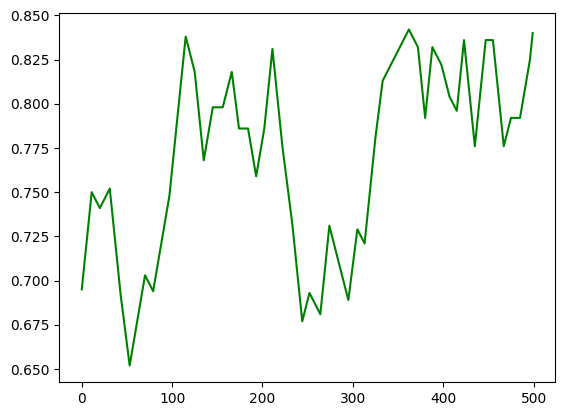

```
# adding squiggles
# will reuse the previous set of values
yy_data = [x + random.randint(-5,5) / 500 for x in y_data]

plt.plot(yy_data, 'g')
plt.show()

#this does not constrain value in the range [0, 1) as required for the lab
```

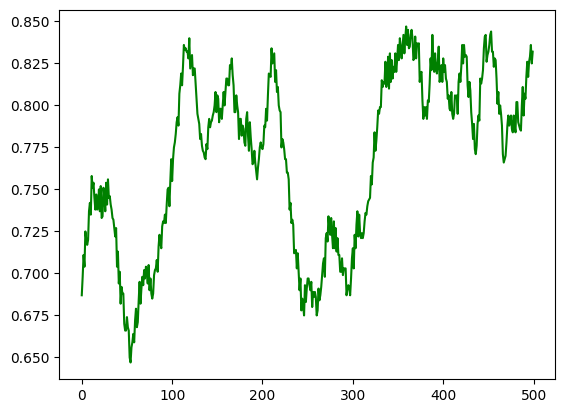

```
#generating a saw-tooth waveform
base = 0.5
min = 0.2
max = 0.8
delta = 0.025
size = 200
def generator_6():
  global base, min, max, delta
  if base < min or base > max:
    delta *= -1
  base += delta
  return base

y_data = [generator_6() for _  in range(size)]
plt.plot(y_data)
plt.show()
```

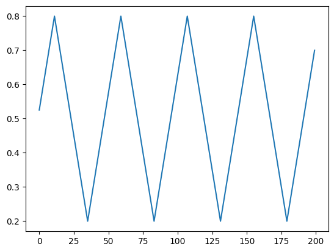

```
period = 20
delta = 0.2
size = 200
def generator_7():
  global period, delta
  period -= 1
  if period == 0:
    delta *= -1
    period = 20
  return 0.5 + delta #+ random.randint(-5,5) / 500

y_data = [generator_7() for _  in range(size)]
plt.plot(y_data)
plt.show()
```

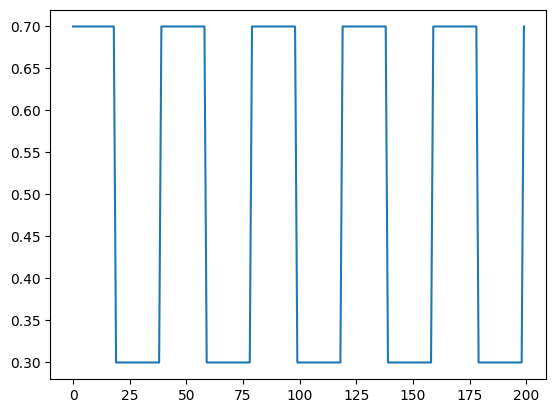
