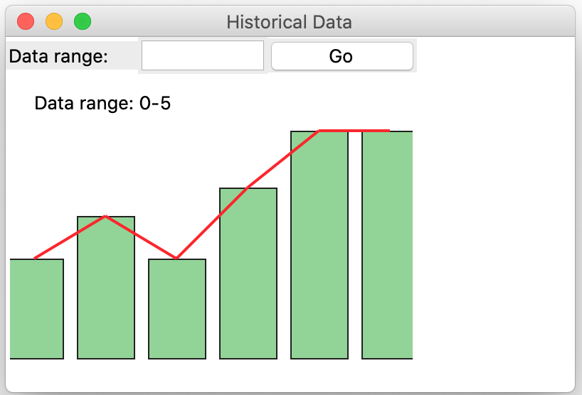
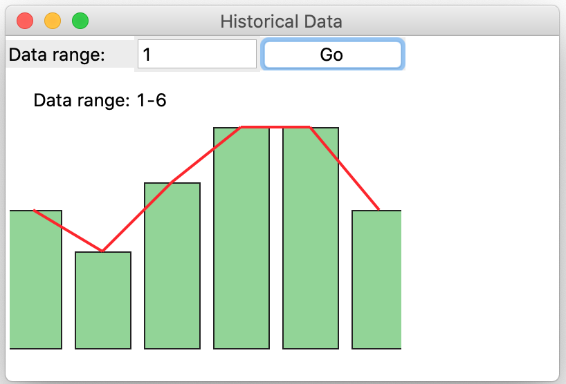

# Final Project

This is the final project of COMP216. It is a group effort that will
replace your second test and will contribute 30% towards your final
grade. This builds on the previous week’s labs, which may require some
tweaking to assemble into a complete IoT solution. We will discuss on a
mutually convenient submission date.

## Before You Start

This is a large undertaking considering the time constraints and the
number of components required. One person would not do able to and
should not be doing all the work because of the volume and the scope.
Because the time is not enough sufficient for one person to adequately
complete all the prescribe tasks.

I suggest short (not more than 15 minutes) meeting frequent (at least 5
time per week), where designs are finalized, tasks are farmed out and
reported back on. You can also examine the milestones and see if more
effort is needed to bring any lagging task up to the expected
completeness.

Make use of your favourite collaboration platform: WhatsApp™, Discord™,
Slack™, Signal™, Telegram™, Teams™ etc. and relegate e-mails to formal
correspondence.

### Intellectual Property

Software ownership is intellectual property. It is critical to
understand that you may not take credit for something that you do not
own/create. If you use code or algorithm or ideas from somewhere, it is
ethical and the right thing to acknowledge the owner of the intellectual
property. For this course if this happens, then you are committing
plagiarism and punishment can range from a reprimand to zero to
expulsion.

### Technical Constraints

You will only use the libraries that were covered in classes. You will
use Python version 3.9 or later. The only external frameworks/libraries
allowable are requests, flask, and mosquito. You may use the libraries
in a standard python distribution with restraints.

You must use 90% of the code from your previous labs.

## Overview

We will implement an end-to-end IoT solution that will satisfy your
client needs (this is based on your previous labs). We will use the MQTT
protocol for this implementation. There will be publisher clients that
sends data to a broker as well as subscriber clients that receives data
from the broker. The broker sends data to the appropriate subscriber.

You will design and build both types of clients according to
specifications. The diagram shows an overly simplified architecture of
the intended system.

Each component is described more fully below along with the weight
contribution towards the final grade. Each component must be implemented
be well designed class.

## Summary Rubric

The weight includes design, implementation, and demonstration of a
particular component.

No written documentation is required, only your python code files. Your
source files should have only one class per file.

## Detailed Description

### Broker

**5 marks**

You will install the Eclipse mosquito broker and ensure that it is
working as expected.

**40 marks**

### Publisher

The publisher will generate data to send to the broker at regular
intervals. The data value must be random with a pattern (I know that
this is a contradiction). Think of the value of a particular stock on
the stock exchange or the outdoor temperature around your home.

This must be implemented as a GUI and must include an interface to
change the various parameters of this publisher.

You will configure and run multiple publisher clients to simulate
multiple devices.

#### Publisher – Value generation

**17 marks**

This must be implemented in a class in a separate file. (Just import the
filename without the .py extension in the file where you want to use the
logic). This must be based on **Lab Assignment 6**. You must not limit
the number of values generated.

The design should be such that it is easy to use and flexible enough to
be able to give the data value in the required pattern.

\[Specifications of **Lab Assignments 6** more rigidly enforced.\]

**8 marks**

#### Publisher – Packaging the above values

The above value must be tagged with at least a time stamp packet id and
packaged as a JSON object before transmission. You decide what other
features you need to encapsulate in your package. \[See **util.py**\]

#### Publisher – Sending data to broker

**10 marks**

-   You will send the above packaged data to the broker under an agreed
    topic. \[See **publisher.py**\]

-   You must miss transmission with a frequency of about 1 in very 100
    transmissions. This must not be deterministic!

#### Publisher – Extras

These extras are for bonus points and will only be considered if all the
normal specifications are satisfied adequately.

-   To simulate a real-world scenario, occasionally skip blocks of
    transmissions (or sets of transmission). This condition must not
    throw the subscriber into confusion.

-   Transmit “wild data” something that is completely off the chart.
    Again, your subscriber should be able to handle this.

-   Anything that will add value to your project. You must make me aware
    of these.

**45 marks**

### Subscriber

The subscriber accept data from the broker and process it. It will
decode the data and decide how to process it.

This is best implemented as a GUI application.

You will configure and run multiple subscriber clients to simulate
multiple devices.

**10 marks**

#### Subscriber – Receiving data from the broker

-   You will listen to messages from the broker under an agreed topic.

-   You will decode the message and decide how to handle the data

#### Subscriber – Handling the data/absence of data

**30 marks**

This section is important because this is where you imbue your
personality on this project. You must decide what is out of range data.
You also must be able to detect missing transmission.

-   Handle sensible data. Display data both in text and visual formats.

-   Detecting and handling out of range (erroneous) data.

-   Detecting and handling missing data.

-   Implementation of SMTP functionality to send email notification in
    event of erroneous or missing data.

**Subscriber – Extras**

These extras are for bonus points and will only be considered if all the
normal specifications are satisfied adequately.

-   To simulate a real-world scenario, occasionally skip blocks of
    transmissions (or sets of transmission).

-   User accessible controls to unsubscribe from and resubscribe to a
    designated topic.

-   Anything that will add value to your project. You must make me aware
    of these.

**5 marks**

### Quality of Code

These 5 points are to lose. You automatically start with full points and
as the instructor notices code aberration these 5 points will evaporate.
Code aberration will include design flaws and implementation blunders.

**5 marks**

### Video of Project

You make a 10 – 15-minute video that will demonstrate each of the item
in the rubric table. If an item is not clearly demonstrated, there might
be a possibility that you might not get a point for that item.

You need not demonstrate quality of code.

### Due: 

See schedule for due date.

##### Submission

1.  You will bundle all your files (except the video) into a single zip
    file (not .rar or anything else). The name of the file will be
    group\_«your_group_number».zip e.g., group_1.zip.

2.  Your publisher code files must be called
    group\_«your_group_number»\_publisher.py e.g., group_1_publisher.py.

3.  Your subscriber code files must be called
    group\_«your_group_number»\_subscriber.py e.g.,
    group_1_subscriber.py.

4.  All your other code files must be prefixed by you group number e.g.,
    group_1_data_generator.py.

5.  Must be uploaded to course dropbox.

6.  The video file must be uploaded directly in the drop box following
    the same naming conventions.