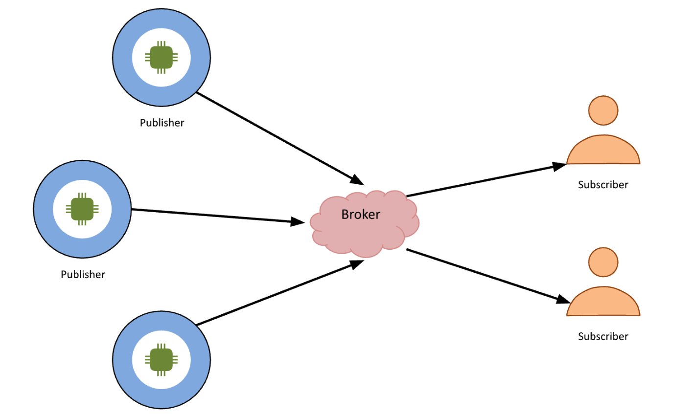
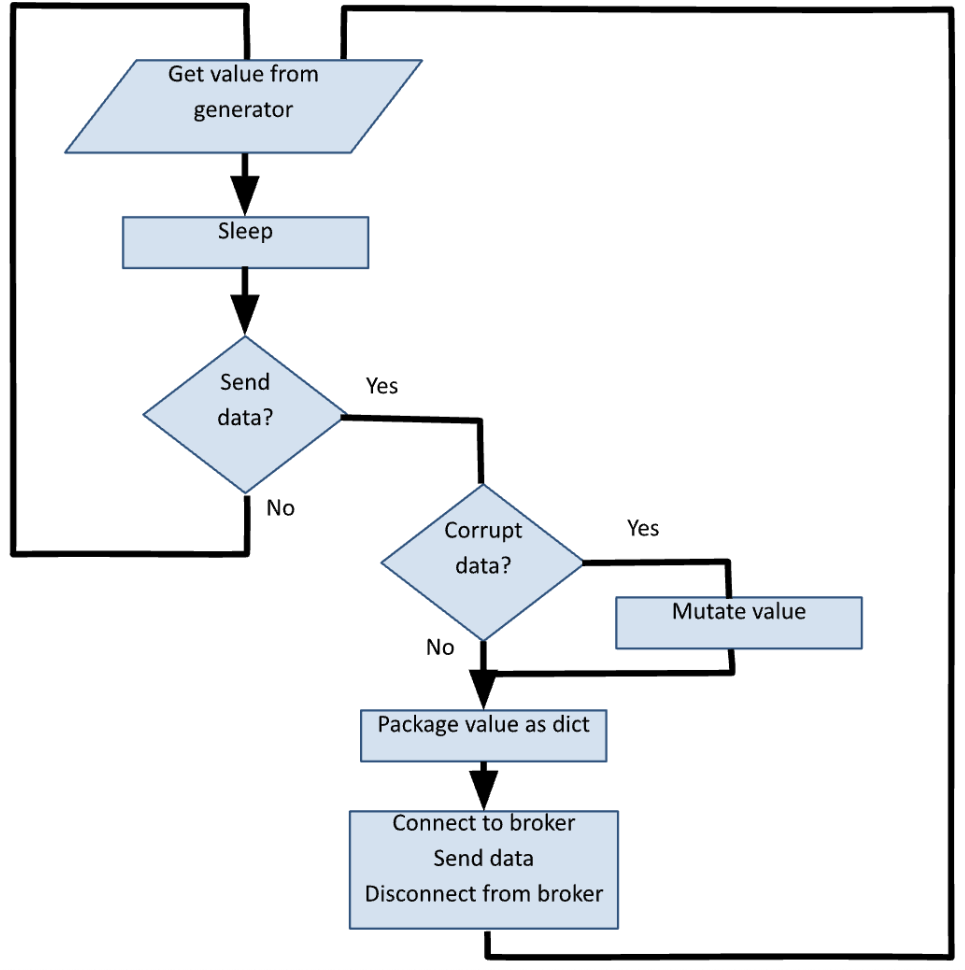

# Interactive Display

This is a group lab that will contribute towards your final project. One
person will submit this work. You will need two submissions to satisfy
this assessment.

We will build a GUI to display a value. Most displays either show the
value as a bar (either vertical or horizontal) or a circular gauge. You
will build two Tkinter applications to display a single value. You will
also provide a text field to change the value. You will also provide
additional information to add credibility to your display.

If you are displaying the indoor temperature, you should state the units
and the low value, normal range, and high value.



## Requirements:

1.  You will use the same quantity that you selected in the previous lab
    (from temperature, humidity, barometric pressure, customers at a
    mall, or just with an alternate descriptor).

2.  Design and build a GUI application class that will model a display
    for your sensor reasonably well.

3.  You must provide an Entry (Textbox) and a button to change the
    value.

4.  There are marks for aesthetics.

See the appendix of this document for code samples and possible
directions to explore.

#### Submission

1.  Your code file will be named
    group\_«your_group_number»\_display_gauge.py e.g.,
    group_1\_display_gauge.py and group_1\_display_bar.py.

2.  Must be uploaded to the course dropbox before the deadline.

3.  See schedule for due date.

#### Rubrics

**Line Chart (Lab 7)**

| Criteria              | Points |
|-----------------------|--------|
| GUI                   | /3     |
| Entry/Button          | /2     |
| Description of value  | /1     |
| Aesthetics            | /4     |
| **Sub-total**         | **/10**|

**Gauge (Lab 8)**

| Criteria              | Points |
|-----------------------|--------|
| GUI                   | /3     |
| Entry/Button          | /2     |
| Description of value  | /1     |
| Aesthetics            | /4     |
| **Sub-total**         | **/10**|

## Sample Code:

The following example accentuates a canvas widget built with Tkinter:

https://anzeljg.github.io/rin2/book2/2405/docs/tkinter/colors.html

```python
from tkinter import Tk, Canvas, Frame, BOTH, W


class Example(Frame):


    def __init__(self):
        super().__init__()
        self.initUI()


    def initUI(self):
        self.master.title('Lab 9 A & B')
        self.pack(fill=BOTH, expand=1)


        canvas = Canvas(self)
        canvas.create_line(15, 25,     #start x,y
        200, 25)                       #end x,y


        canvas.create_line(300, 35, 300, 200, 
        dash=(4, 2))                   #line style
        
        canvas.create_line(55, 85,     #first point
        155, 85,                       #second point
        105, 180,                      #third point
        55, 85)                        #back to first point


        canvas.create_arc(200, 100,    #top left
        260, 160,                      #bottom right
        start=45, extent=135,          #start angle how far to go
        outline='#77f', fill='#f11', width=2)
        
        canvas.create_oval(200, 150,   #top left
        280, 230,                      #bottom right
        outline='#f11', fill='#1f1', width=2)


        canvas.create_rectangle(
            320, 140,                  #top left
            370, 190,                  #bottom right
        outline='#222', fill='#f76')
        
        canvas.create_text(20, 220, anchor=W, font='Purisa', 
        text='Narendra is the greatest!')
        canvas.pack(fill=BOTH, expand=1)
        
root = Tk()
ex = Example()
root.geometry('400x250+300+300')
root.mainloop()
```


